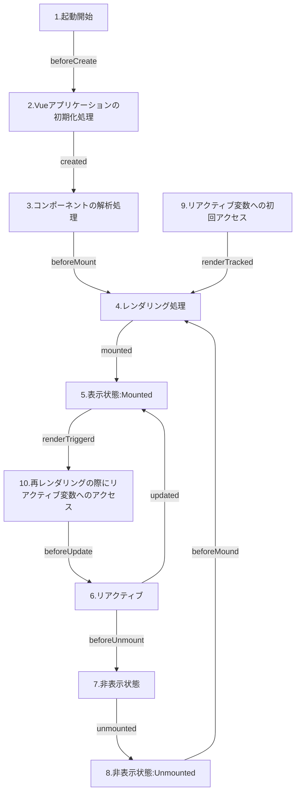

# 第 7 章 スクリプトブロックのバリエーション

## 1. ウォッチャー

- リアクティブ変数として必要なデータを切り出したり加工する場合には算出プロパティを使うと便利だが、スクリプトブロック内の変数を使用する場面での使用にとどめるべき。
- 非同期処理によって取得したデータなど、算出プロパティで処理するのに推奨されないデータを監視して特定の処理を行う場合は `ウォッチャー` を用いる。

### リアクティブ変数の変化を監視する watchEffect()

- Vue で監視しているいずれかのリアクティブ変数が変化した時コールバック関数を実行できるウォッチャー。
- 初回起動時からコールバック関数が実行される。

### 監視対象を明示する watch()

- 監視対象の変数を指定して、対象の変数が変化した時にのみ発火するウォッチャー。
- デフォルトでは初回起動時にコールバック関数を実行しない。
- 初回起動時にコールバック関数を実行したい場合は、watch 関数の第３引数に `{immediate: true}` を指定する

### watch()における変更前後の値の利用

- watch()では、監視対象の新旧それぞれの値を引数として受け取り、参照できる。
- `{immediate: true}`との併用はできない。

```
watch(監視対象のリアクティブ変数,
    (newValue: 型, oldValue: 型): void => {
        監視対象が変化した際に実行される処理
    }
)
```

## 2. ライフサイクルフック

### ライフサイクル

- Vue の App コンポーネントに生じるさまざまな状態の遷移をライフサイクルと呼ぶ。
- コンポーネントが読み込まれる段階、レンダリングされる段階…など
- ライフサイクルそれぞれの状態に応じて処理を行う関数をライフサイクルフックと呼ぶ。
- 状態の前後に処理を挟みこめるようにライフサイクルフックが用意されている。例えば、レンダリング処理の前後は `beforeMount`, `mounted` で処理を呼び出せる…など

```
on ライフサイクルフック名(() => {
    行いたい処理
})
```



### 解説

1. Vue アプリケーションが起動する
1. Vue アプリケーションの初期化処理で、スクリプトブロック内のコードが実行される。
1. コンポーネントの解析処理で、テンプレートブロック内のコードが解析され、DOM 構造が決定される
1. 3 で決定した DOM 構造がレンダリングされる
1. レンダリング処理が完了すると、画面が表示される（Mounted な状態）
1. リアクティブシステムにより再レンダリングが行われる。レンダリングが完了すると再び Mounted 状態となる
1. 表示が不要となったコンポーネントに非表示処理を行う
1. 非表示処理が完了するとコンポーネントが画面に表示されなくなる。（Unmounted な状態）

### デバッグ用のライフサイクルフック

#### 1. renderTracked

- `renderTracked` は レンダリング中に Vue がリアクティブデータにアクセスするたびに呼び出されるフック。
- デバッグ用の `DebuggerEvent` オブジェクトが渡されるので、レンダリングの際に使用されている値を確認できる。
  - target の値が `RefImpl`: `ref()`によるリアクティブ変数でレンダリングされた
  - target の値が `ComputedRefImpl`: `computed()` によって生成されたオブジェクトでレンダリングされた

#### 2. renderTriggered

- `renderTriggered` は、再レンダリングに先立ち、リアクティブ変数の値の変化を検知した際に呼び出されるフック。
- デバッグ用の `DebuggerEvent` オブジェクトに `newValue` プロパティが生えるので、リアクティブ変数がどのように変化したかを確認できる。

### その他のライフサイクルフック

| ライフサイクルフック名 | 呼び出しのタイミング                           |
| ---------------------- | ---------------------------------------------- |
| errorCaptured          | 配下のコンポーネントを含めエラーを検知した時点 |
| activated              | コンポーネントが待機状態ではなくなった時点     |
| deactivated            | コンポーネントが待機状態になった時点           |

## 3. script setup の本当の姿

- script setup タグが登場したのは Vue 3.2 以降。
- それ以前はコンポーネントの処理内容を定義する `defineComponent()`関数の実行結果を export していた。

### script setup が使えない場合

```
<script lang="ts">
import { defineComponent, ref, computed } from 'vue'

export default defineComponent({
  name: 'App', <- コンポーネント名を定義
  setup() { <- これまでスクリプトブロックに記述していた内容
    const sampleValue = ref('サンプルの変数')
    return {
        sampleValue
    }
  }
})
</script>
```

### script setup が使えるとコードがすっきりする

```
<script setup lang="ts">
import { ref, computed } from 'vue'

const sampleValue = ref('サンプルの変数')
</script>
```

## Options API

- Vue2 まで使用されていた記述方法。
- watchEffect は存在しない。

### Options API 　の課題点

- リアクティブな変数をスクリプトブロックで利用する時に `this.プロパティ名` と記述する必要があるため、watch プロパティなど、関数内の関数で `this` を利用した場合に参照したいデータに辿り着けなくなる
- 各プロパティがばらばらに列挙されるため、コードが散在してしまう。コードの見通しが悪くなり再利用性も低下する。
- …という課題点を、Composition API では setup 属性などを用いて解決した。
