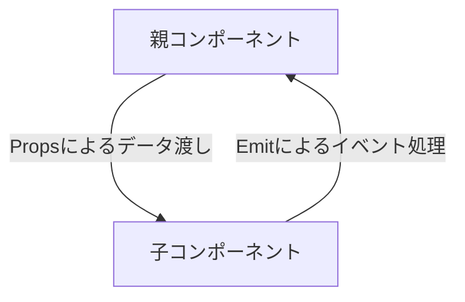
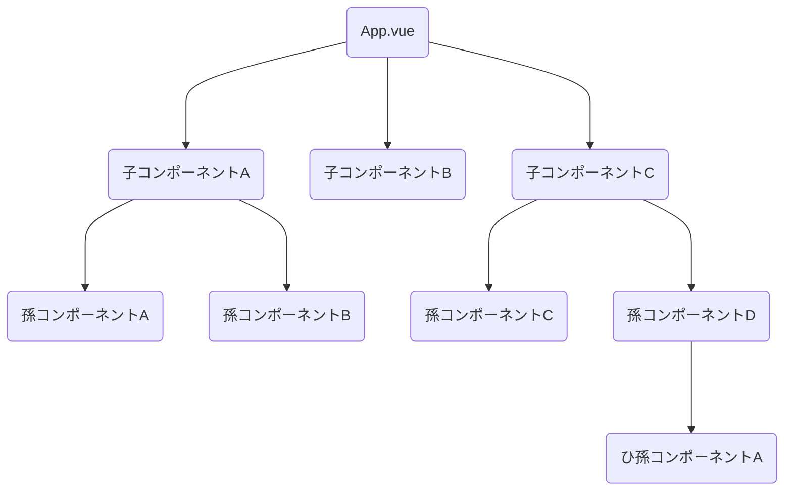
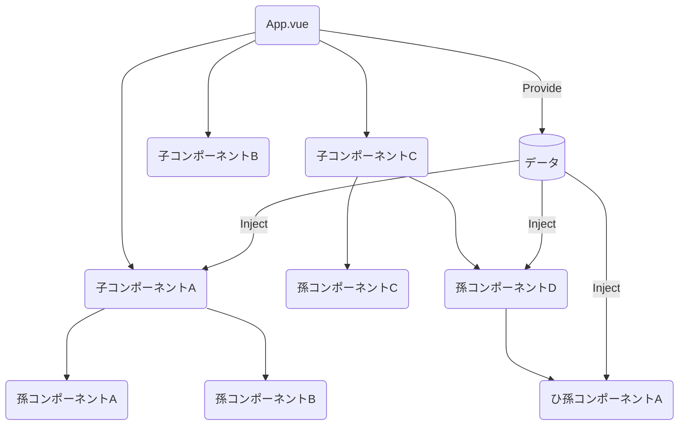

# 第 8 章 コンポーネント間連携

## この章でやること

- コンポーネントの内容を別のコンポーネントに分割するために、コンポーネントを追加する方法
- コンポーネントから別のコンポーネントを利用する方法
- 複数のコンポーネントを連携する方法

## コンポーネントとは

- HTML, CSS, スクリプトをワンセットとして再利用可能な部品としたもの。
- `.vue` など、ひとつのファイルのコンポーネントをまとめて記述したものをシングルファイルコンポーネント(SFC)という。

### コンポーネント内の処理の影響範囲

- スクリプトブロックの処理はコンポーネント内で完結する。
- スタイルブロックに記した CSS は他のコンポーネントのスタイルブロックにも影響する・される。
- コンポーネントごとに独立した CSS を記述したい場合は、 `scoped` 属性を style タグに付与する。これを`Scoped CSS` と呼ぶ。
  - scoped CSS が設定されたコンポーネント由来のタグには `data-v-####` という属性が自動で付与され、スタイルブロックに記述したセレクタにも同じ属性セレクタが自動で付与されることで、スコープを絞った CSS が反映できるようになっている。

## 親から子へのコンポーネント間通信

### 親からデータをもらう Props

- 親コンポーネントから子コンポーネントを呼び出す際は Props を使用する
  - 子コンポーネント
    - Props を定義
    - スクリプトブロック内で Props の値の有無によって処理を変えたい場合は、`defineProps()` 関数で Props を変数として受け取る処理も記述する
  - 親コンポーネント
    - 子コンポーネントを呼び出す際に、プロパティに必要な値を受け渡す
- Props の値は子コンポーネントでは直接変更できない。readonly である。
- Props のデフォルト値は `withDefault()`関数を使って設定できる。

```
withDefault(
    defineProps<Props>(),
    { 非必須Prop名: デフォルト値, ...}
)
```

## 子から親へのコンポーネント間通信

- `Emit` を利用して通信を行う。

### コードの記述手順

1. 親コンポーネントの記述
1. 処理メソッドの用意: 子コンポーネントから通知を受けた（イベントが実行された）際に実行する
1. v-on ディレクティブの記述
1. 子コンポーネントの記述
1. Emit の定義
1. Emit の実行: 引数としてイベント名文字列を渡す

### 親コンポーネントにデータを渡す方法

- `emit()`の第二引数にデータを指定する。
- 第二引数を利用する場合、あらかじめインターフェースに定義しておく必要がある。

```
interface Emits {
  (event: 'incrementPoint', id: number): void
}
```

### v-model による子から親への通信

- 子コンポーネントタグの属性として Props にデータを渡すディレクティブに `v-bind:value` ではなく `v-model`を使うことで Props のデータが Emit による変更対象となる。
- emit の引数に `emit(update:対象プロパティ, 入力値)` を指定する。

## Provide 　と Inject

### コンポーネント間通信のまとめと問題提起



- 上記相互の通信は「Props ダウン、イベントアップ」と呼ばれる
- しかし、実際のアプリケーションでは App.vue を頂点としてコンポーネントの階層が複雑化するため「Props ダウン、イベントアップ」方式だけではコードも複雑となる。



- 解決するために生まれたのが Provide-Inject の仕組み。
- App.vue にてアプリケーション全体で参照されるデータを提供（Provide）しておくと、どこからでもデータの注入（Inject）が利用できる



### Provide 　と Inject の利用方法

- 値を provide する際は reactive 関数を利用することでコンポーネントにおいてリアクティブ変数として利用できるようになる。
- inject()の戻り値は unknown 型となるため、型アサーションを行う必要がある

```
# Provideサンプル
const memberList = new Map<number, Member>()
// 省略
provide('memberList', reactive(memberList))

# Injectサンプル
const memberList = inject('memberList') as Map<number, Member>
```
