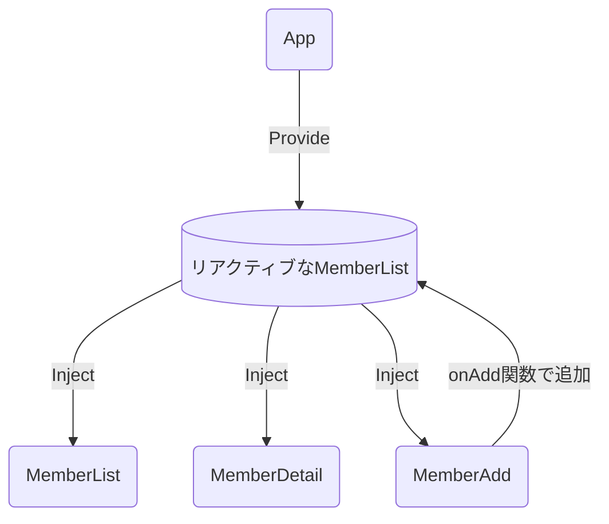
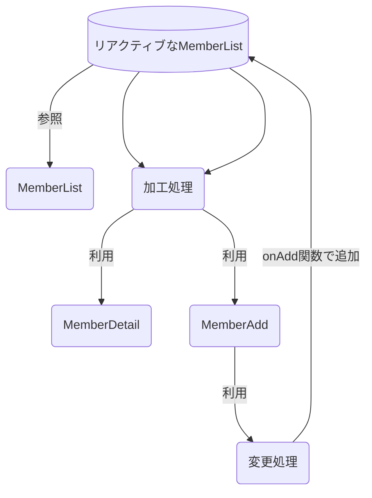

# 第 11 章 Pinia

## この章でやること

- コンポーネントを横断するデータのやり取りをするために使う Vuex の代替ライブラリである Pinia について説明
- Provide/Inject で課題となることを解決するために Pinia を使う

### 参考リンク

- [Pinia 公式](https://pinia.vuejs.org/introduction.html)
- [Pinia の基本的なつかいかた](https://qiita.com/Naoto_Ito/items/ede2b0a09f474df5e704)
- [Pinia を使って状態管理](https://www.webdesignleaves.com/pr/plugins/vue-basic-05.html)

## Pinia の基本

### Provide/Inject の問題点

Provide されたデータ（MemberList）を子コンポーネントで Inject して使用するだけでなく、データに変更を加える場合がある。  
そうなると、どのコンポーネントでどのような変更が行われているのか管理ができなくなる。  
結果、アプリケーションのメンテナンス性が低下してしまう。

_データの処理コードを 1 箇所にまとめ、「データの変更」と「データの保持」を分離することが求められる。_



### Pinia を使って解決する

- Pinia は、コンポーネントをまたいで状態（State）を共有・管理するためのストアライブラリ。
- 以下の図でいうと、「リアクティブな MemberList」の管理と、「加工処理」「変更処理」が Pinia の管理対象。
- ストアで用意された関数を利用して変更・加工を行う。
- コンポーネントで取得したい場合はストアのデータ本体を参照する。



### Store ファイル内の基本構造

1. pinia からストア定義用の関数 `defineStore` を import する
1. defineStore の第一引数に Store の一意な値を定義する
1. データ本体を `state` として定義する
1. データの加工処理を `getter` として定義する
1. データの変更処理を `actions` として定義する

※ 上記は Options API 風のお作法。Composition API 風に定義する場合は、state, getter, actions の定義は省略して以下のように記述できる

```
import { ref, computed } from 'vue'
import { defineStore } from 'pinia'

export const useCounterStore = defineStore('counter', () => {
  const count = ref(0) // state定義の代わりにrefする
  const doubleCount = computed(() => count.value * 2) // getter定義の代わりにcomputedする
  function increment() { // actionsの代わりにfunction定義する
    count.value++
  }

  return { count, doubleCount, increment } // useCounterStoreとしてexportしたい定義を最後にreturnする
})

```

### state の値をリセットしたい

- `$reset` は setup 構文では使用できない

```
counterStore.$reset();
```

- その場合は value を 0 に書き換えることでリセットする

```
counterStore.count = 0;
```

- 書き換えたい値が複数ある場合は `$patch` を使用する

```
counterStore.$patch({
    count: 0,
    name: '',
    order: 1
});
```
